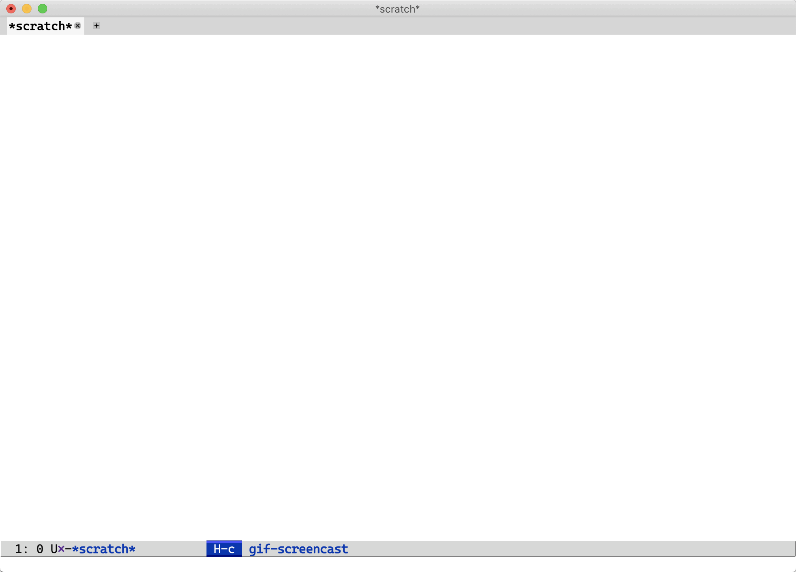

# ivy-mairix, an Ivy interface for the Mairix mail indexing program

ivy-mairix is an [Ivy](https://github.com/abo-abo/swiper) interface for rapidly going through [Mairix](https://github.com/vandry/mairix) search
results. By default, Mairix works by saving the search results into a separate
file, like a unix [Mbox](https://en.wikipedia.org/wiki/Mbox) file, and then you point your email program to that file
to display the result. This can be quite inconvenient, since you have to reopen
the search mailbox every time your search query changes. Using Ivy, we can now
interactively refine our search and view the results in real time.

Currently this is very much a **work in progress**. ivy-mairix depends on the  [Emacs
Interface for Mairix](https://www.gnu.org/software/emacs/manual/html_node/mairix-el/index.html) which is bundled with Emacs. It should work out of the box by
invoking <kbd>M-x ivy-mairix</kbd> if you have configured it properly (see [Installation](#installation) below).

**Patches are welcome!** Please note that this package is intended to be a part
of GNU ELPA, thus for patches over >15 lines your FSF paperwork ought to be in
order. Please mail patches to my [public inbox](https://lists.sr.ht/~ane/public-inbox) at [~ane/public-inbox@lists.sr.ht](mailto:~ane/public-inbox@lists.sr.ht).

## Demonstration

*Mairix running on (mostly) the [September 2020 archive of emacs-devel@gnu.org in Mbox format](https://lists.gnu.org/archive/mbox/emacs-devel/2020-09)*.



## Installation

A prerequisite on the system is obviously that Mairix is installed and
configured properly. See [(mairix-el)Configuring mairix](https://www.gnu.org/software/emacs/manual/html_node/mairix-el/Configuring-mairix.html). 
 
Since this is still alpha quality software, it is not available in any package
repository. Thus clone it somewhere in your system and add it to your load path:

``` emacs-lisp
(add-to-list 'load-path "<path-to-this-repo>")
```

If you have the [Emacs Interface for Mairix](https://www.gnu.org/software/emacs/manual/html_node/mairix-el/index.html) configured properly then this should
work without any additional configuration. Otherwise, you need to configure it.
For example, if you use Mairix with Mbox format results, configure it like this:

 ``` emacs-lisp
(setq mairix-file-path "~/mail")        ;; The folder where the search file is stored
(setq mairix-search-file "search.mbox") ;; Name of the search file itself
```

## TODO stuff (if you feel like contributing)

  * support for threads (i.e. the prefix arg on `ivy-mairix`)
  * support for Gnus and VM frontends
  * `counsel-mairix` i.e. a version of `ivy-mairix` where the current buffer
    changes to display the selected mail
  * tests!
  
These could go into the ticket tracker.

## Copyright & License

Copyright &copy; Antoine Kalmbach. Licensed under the GNU GPL version 3.
